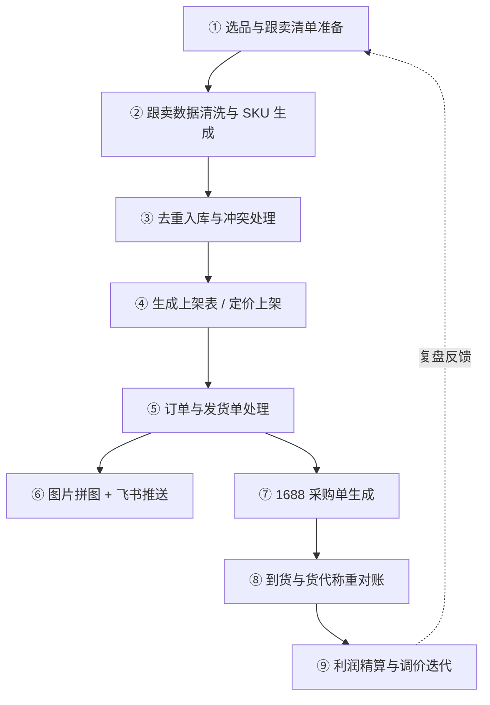

# 电商运营工作流程（亚马逊跟卖工作台）

> 本文档以「亚马逊跟卖工作台」的实际功能模块为准，梳理一条从选品跟卖到利润复盘、调价迭代的完整运营链路。
> 文中的规则、阈值、字段均对应系统真实实现，可作为运营 SOP 与新人培训手册使用。

---

## 一、总览：什么是跟卖式电商运营

跟卖（Follow-Sale）模式的核心是：**不自行开发产品，而是跟随已有 Listing 售卖同款商品**，通过价格与库存的快速调整抢占购物车（Buy Box）。

因此运营的重心不在「产品设计」，而在四件事：

| 重心 | 说明 | 对应系统模块 |
|------|------|--------------|
| **数据准确** | SKU、颜色、尺码、重量必须干净且可追溯 | 上传中心 / 商品库 / 乱码映射 |
| **不重复** | 同一商品多次录入不能产生重复档案 | 去重审核 |
| **成本可控** | 采购价、运费、附加费要精算到分 | 采购单 / 配置中心 |
| **利润可视** | 实时知道每个 SKU 的保底价与净利，才能调价 | 利润报告 |

---

## 二、整体流程图



配套的九宫格工作台页面：

`上传中心` · `商品库` · `乱码映射` · `去重审核` · `重量批次` · `称重对账` · `采购单` · `利润报告` · `配置中心`

---

## 三、环节详解

### ① 选品与跟卖清单准备

**目标**：确定要跟卖哪些 Listing，并准备一份原始数据表。

- 数据来源通常是亚马逊后台导出的订单/商品明细，或手工整理的跟卖候选表。
- 关键字段（系统可自动识别列名）：`ASIN`、`标题`、`颜色`、`尺码`、`售价`、`SKU`。
- 系统内置 **19 个标准字段的列名别名库**，支持中英文、全半角、空格/下划线混排，例如「颜色 / color / 颜色名称 / 颜色属性」会被识别为同一字段。

> **运营要点**：这一环节只需保证表格有表头且字段含义清晰，**不需要人工改列名为标准格式**，列名识别由系统承担。

---

### ② 跟卖数据清洗与 SKU 生成

**目标**：把脏数据变成规范 SKU。

**入口**：上传中心 → 跟卖清单上传

**处理链路**：

1. **颜色/尺码字典归一化**（三级策略，逐级兜底）
   - 第一级：直接命中标准值（大小写不敏感），如 `Black` → `黑色`
   - 第二级：精确命中别名，如 `blk` / `BK` → `黑色`
   - 第三级：包含匹配（长别名优先，别名长度 ≥ 2），如 `深黑色` 含 `黑色` → `黑色`
   - 未命中：保留原值并加 `*` 标记，进入 **待确认**，同时计入 `new_colors` / `new_sizes`

2. **SKU 生成规则**：`前缀-颜色-尺码`
   - 前缀为 4 位数字（从 `0001` 起递增）
   - **同款复用**：标题完全一致的多个变体共用同一前缀（基于标题 MD5 稳定哈希，跨进程重启结果不变）
   - 示例：`0001-黑色-M`、`0001-白色-L`

3. **标记待确认行**：颜色或尺码带 `*` 的行会被单独列出，**不进入入库流程**，等待运营补充字典后重跑。

> **运营要点**：出现 `*` 待确认值不是报错，而是系统的保护机制——避免把「未收录的颜色」错误归一到已有颜色上，导致后续对账错乱。

---

### ③ 去重入库与冲突处理

**目标**：同款商品只建一份档案，冲突交人工判断。

**核心规则**：

| 规则 | 说明 |
|------|------|
| **去重键** | `SKU`（含乱码 SKU 经别名映射后的结果） |
| **比对字段** | asin、title、color、size、category、purchase_price、purchase_url、p1688_id、purchase_spec |
| **重量特殊** | 重量是**批次变量**，永远追加不判重 |
| **库中空缺不算冲突** | 老档案该字段为空时，新值直接补齐 |

**三种入库结果**：

- `added` 新增 —— 商品档案不存在，创建新记录（颜色/尺码带 `*` 时状态为「待确认」，否则「active」）
- `skipped` 跳过 —— 所有比对字段完全一致，无需处理
- `conflict` 冲突 —— 存在字段值不一致，写入 **去重审核** 队列，状态 `pending`

**人工裁决**（去重审核页）：

- 采用新值 → 覆盖商品库对应字段，记录状态改为 `approved`
- 保留旧值 → 仅标记 `rejected`，商品库不变

> **运营要点**：冲突往往意味着「同一个 SKU 前后两次采购的规格/标题被供应商改过」，需要人工确认是否是同一商品，避免误合并。

---

### ④ 生成上架表与定价上架

**目标**：产出可直接导入亚马逊后台的上架表格。

**输出**：`上架表_{批次}.xlsx`，严格按 8 列模板：

| 列 | 内容 | 来源 |
|----|------|------|
| Asin | ASIN | 上传数据 |
| SKU | 规范 SKU | 系统生成 |
| 价格 | **留空 + 黄色高亮** | 待运营填 |
| 采购链接 | 1688 链接 | 自动取商品库已维护值 |
| 保底价 | **留空 + 黄色高亮** | 待运营填 |
| 单次调整金额 | 默认 `0.50` | 配置中心 |
| 库存 | 默认 `10` | 配置中心 |
| 最大订单数量 | 默认 `5` | 配置中心 |

> **运营要点**：价格与保底价刻意留空并黄底高亮，是为了强制运营在报价前参考 **利润报告** 中的保底价计算结果，而不是凭感觉定价。

---

### ⑤ 订单与发货单处理

**目标**：把每日发货单变成结构化订单记录 + 利润快照。

**入口**：上传中心 → 发货单上传

**幂等保护**：批次号 = `SH + 日期 + 文件 MD5 前 8 位`。同一文件重复上传会被识别为「已处理」并直接返回，**不会重复记账**。

**处理链路**：

1. **乱码 SKU 还原**：先查别名映射表，再查规范 SKU
2. **未入库自动建档**：尝试解析规范 SKU，颜色尺码过字典后自动入库
3. **无主 SKU 登记**：识别不了的 SKU 写入 **乱码映射** 页（备注「待人工识别」），并计入 `unknown_sku` 统计
4. **重量记录**：有重量则追加一条 `source=发货单` 的重量记录
5. **图片获取**：优先提取 Excel 内嵌图片（按行锚定），外链图片作为兜底下载
6. **利润初算**（当日日账口径）：
   ```
   预估利润 = 销售额 - 采购成本 × 件数 - 运费(含偏远附加费)
   ```
   - 缺产品 / 缺采购价 / 缺销售额时，不计算并在备注中说明原因
   - 计算出结果时备注为「未对账·日账口径」，提示该数字尚未经货代称重复核

> **运营要点**：日账口径的利润是**快速参考值**，运费按模板估算、重量按上传值。最终利润以环节 ⑧ 对账后的数据为准。

---

### ⑥ 图片拼图与飞书推送

**目标**：让仓库/客服一眼看清本批次发了哪些货。

- **拼图生成**：将本批次所有商品图片按最多 4 列网格拼接成大图，每张图下方标注 `SKU + 跟踪号`，无图的位置画灰框占位
- **飞书推送**（两级能力）：
  - 文本推送：批次号、订单数、新增/跳过/冲突/待映射统计、拼图文件名 —— 通过自定义机器人 Webhook
  - 图片推送：上传拼图到飞书并发送图文消息 —— 需配置 App 凭证 + 群聊 chat_id
- Webhook 未配置时仅生成本地文件，不推送，不影响主流程

---

### ⑦ 1688 采购单生成

**目标**：把发货需求转成可直接下单的采购单。

**入口**：上传中心 → 采购匹配

1. **订单匹配**：按 SKU 找到商品库中已维护的 1688 映射（`p1688_id`、采购链接、规格、采购单价）
2. **输出两类结果**：
   - `matched` 已匹配 —— 可直接生成采购单
   - `unmatched` 未匹配 —— 区分两种原因：「未匹配 1688 映射」（产品已入库但没填 1688 信息）/「产品未入库」
3. **生成采购单**：`1688采购单_{批次}.xlsx`，7 列结构 —— ID(1688)、1688 链接、亚马逊子 SKU、1688 规格、数量、采购单价、采购地址
4. 采购地址取自配置中心 `purchase_address`

> **运营要点**：`unmatched` 列表就是当日的待办清单——产品未入库的回商品库建档，未匹配映射的回商品库补 1688 链接与规格。

---

### ⑧ 货代称重对账

**目标**：核对「我方重量」与「货代重量」，发现计费异常。

**入口**：上传中心 → 货代称重上传

**处理逻辑**：

1. 按跟踪号匹配发货订单
2. 我方重量取值优先级：
   - 发货订单记录中的重量（来源标注为「发货单(某SKU)」）
   - 否则取该产品按优先级算出的**有效重量**
   - 都没有则记为「未知产品」
3. **差异计算**：`差异% = (货代重量 - 我方重量) / 我方重量 × 100`
4. **预警判定**：差异绝对值 > 阈值（默认 **3%**）则标记 `alert=1`
5. **采用货代重量**：勾选记录后一键写入重量历史（`source=货代`），标记 `resolved=1`

**重量取值优先级（四级兜底）**：

| 优先级 | 来源 | 含义 |
|--------|------|------|
| 1 | 货代 / 确认 / 手动 | 实测确认重量，最可信 |
| 2 | 发货单 | 当日发货单所填重量 |
| 3 | 历史均值 | 该产品所有历史重量的平均值 |
| 4 | 参考重量 | 商品库中手工填写的兜底值 |

> **运营要点**：称重差异超 3% 多数是三类问题——货代计费重取整规则、包装材料变更、原填重量错误。采用货代重量后，第 1 优先级生效，后续所有利润计算都会自动切换到更准的重量。

---

### ⑨ 利润精算与调价迭代

**目标**：算出每个 SKU 的保底价与真实净利，指导调价。

**入口**：利润报告页（可导出 `利润分析报告.xlsx`）

**两个核心公式**：

```
保底价 = (采购成本 + 预估运费 + 偏远附加费) / (1 - 佣金率 - 目标毛利)

单件净利 = 售价 × (1 - 佣金率) - 采购成本 - 运费(含附加费)
```

**参数来源与默认值**（配置中心可改）：

| 参数 | 默认值 |
|------|--------|
| 平台佣金率 | 15% |
| 目标毛利率 | 30% |
| 单次调整价格 | 0.50 |
| 默认库存 | 10 |
| 最大采购量 | 5 |
| 称重差异阈值 | 3% |
| 汇率 | 7.20 |

**报告输出字段**：SKU、ASIN、标题、颜色、尺码、采购成本、重量、重量来源、预估运费、当前售价、售价来源、保底价、保底说明、单件净利、佣金率。

**保护机制**：
- 缺少采购成本 → 保底说明「缺采购成本」
- 缺少重量 → 保底说明「缺重量，无法估算」
- `佣金率 + 目标毛利 ≥ 100%` → 保底说明「参数错误」，不返回数值
- 「佣金+毛利」参数错误、或重量来源为估算值时，保底说明标注为「预估」而非「确认重量」

> **运营要点**：调价时先看「保底价」，售价跌破保底价即亏损；再看「款号」。注意重量来源为「历史均值/参考重量」的 SKU，其保底价是估算值，需要先完成称重对账再据此调价。

---

## 四、关键业务规则速查

### 运费计算

**优先级**：区间一口价 优先，其次首重续重模板。

| 计价方式 | 公式 |
|----------|------|
| 区间一口价 | 区间价格 + 操作费 × 件数 |
| 首重续重 | 首重价 + ceil((重量 - 首重) / 续重单位) × 续重价 |

**偏远附加费匹配**：先精确匹配完整邮编，再按**最长前缀**匹配（前缀越长越精确）；渠道传空串表示全渠道适用。

**已导入渠道**（加拿大运费模板）：

| 渠道 | 渠道代码 | 重量档位 |
|------|----------|----------|
| 加拿大商业派送（普货） | YTCASP | 0-0.25 / 0.251-0.45 / 0.451-1 / 1.001-3 / 3.001-30 kg |
| 加拿大商派(偏远普货) | YTSPPY | 同上 5 档 |
| 加拿大邮政（普货） | YTCACP | 0-0.15 / 0.151-0.45 / 0.451-0.75 / 0.751-1 / 1.001-30 kg |

偏远附加费共 7 档：`3 / 8 / 15 / 20 / 30 / 45 / 80`。系统会自动把**同国家 + 同前 3 位邮编 + 费用唯一**的记录聚合为前缀规则，减少匹配条目。

### 批次号规则

| 业务 | 批次号格式 | 特性 |
|------|-----------|------|
| 跟卖 | `L + 8位随机` | 每次上传新批次 |
| 发货 | `SH + 日期 + 文件MD5前8位` | **幂等**，重复文件不重复记账 |
| 称重对账 | `CK + 8位随机` | 每次上传新批次 |
| 采购 | `P + 8位随机` | 每次匹配新批次 |

---

## 五、运营日常节奏（SOP）

### 每日

| 时段 | 动作 | 页面 |
|------|------|------|
| 上午 | 上传新的跟卖清单，补充颜色/尺码待确认值 | 上传中心 / 配置中心 |
| 上午 | 处理去重冲突，逐条裁决采用新值或保留旧值 | 去重审核 |
| 上午 | 填写上架表的价格与保底价，导入亚马逊后台 | — |
| 下午 | 上传当日发货单，检查待映射 SKU 与拼图 | 上传中心 / 乱码映射 |
| 下午 | 确认飞书推送是否触达仓库/客服 | — |
| 下午 | 处理采购匹配的 `unmatched` 待办，生成 1688 采购单 | 采购单 |
| 晚间 | 上传货代称重清单，处理超阈值预警 | 称重对账 |

### 每周

- 补齐**乱码映射**：把累积的待识别 SKU 绑定到正式产品
- 校正**重量批次**：核对重量来源分布，把「历史均值/参考重量」为主的 SKU 补上实测重量
- 复盘**利润报告**：筛选净利为负或接近保底价的 SKU，执行调价
- 更新**运费模板**：渠道价格调整时重新导入模板

### 每月

- 校准配置中心参数（佣金率、目标毛利率、汇率）
- 复核字典覆盖率，把高频 `*` 待确认值正式收录为字典项

---

## 六、常见异常与处理对照

| 现象 | 原因 | 处理 |
|------|------|------|
| 颜色/尺码显示 `*xxx` | 字典未收录该值 | 配置中心补充别名，或确认为新标准值 |
| SKU 出现在「乱码映射」待处理 | 发货单 SKU 无法解析为规范 SKU | 人工绑定到对应产品 |
| 去重审核出现 pending 记录 | 同 SKU 多字段值不一致 | 确认是否同款，裁决采用或拒绝 |
| 预计利润备注「缺采购价」 | 商品库未录采购成本 | 商品库补录采购价 |
| 预计利润备注「缺重量」 | 无任何重量记录 | 在重量批次页手工补录 |
| 保底说明「参数错误」 | 佣金率 + 目标毛利 ≥ 100% | 检查配置中心参数 |
| 称重差异超 3% 告警 | 计费重规则 / 包装变更 / 原填错误 | 核实后一键采用货代重量 |
| 发货单重复上传无反应 | 幂等保护生效 | 属正常行为，如需重跑请修改源文件 |
| 采购匹配 `unmatched` | 未维护 1688 映射或产品未入库 | 商品库补 1688 链接/规格或先建档 |

---

## 七、角色与职责参考

| 角色 | 主要职责 | 高频页面 |
|------|----------|----------|
| **选品运营** | 跟卖清单准备、上架定价、调价决策 | 上传中心、商品库、利润报告 |
| **数据运营** | 字典维护、去重裁决、乱码映射绑定 | 配置中心、去重审核、乱码映射 |
| **采购** | 1688 映射维护、采购单执行 | 商品库、采购单 |
| **仓储 / 物流** | 发货、称重、对账预警处理 | 上传中心、称重对账、重量批次 |
| **财务 / 复盘** | 利润核算、参数校准 | 利润报告、配置中心 |

---

## 附：系统启动方式

```bash
# Mac / Linux（默认端口 8000，可用 PORT=8080 覆盖）
cd amazon-toolkit && bash start.sh

# Windows
cd amazon-toolkit && start.bat
```

访问 `http://localhost:8000` 进入工作台；首次运行会自动创建虚拟环境、安装依赖并初始化数据库。

运费模板迁移（首次部署时执行一次）：

```bash
cd amazon-toolkit && python tools/import_templates.py
```